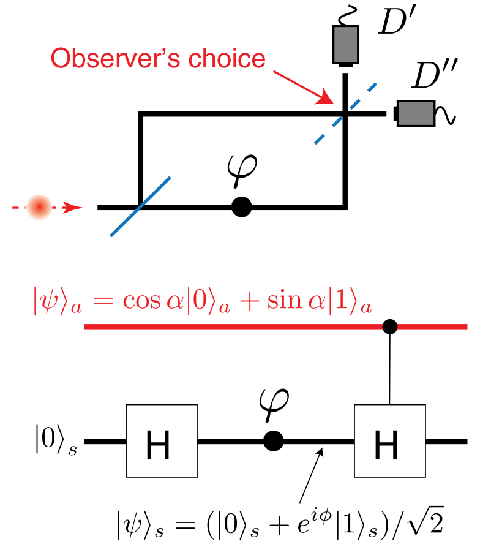
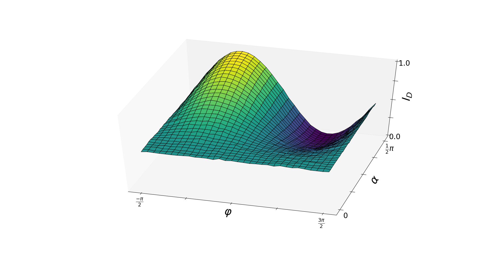

# Quantum-Delayed-Choice-Experiment
Simulating a quantum delayed-choice experiment in which both particle and wave behaviours are investigated simultaneously.

------

# Introduction:

1. Wheeler’s classic delayed choice experiment is a *gedankenexperiment* which has since been demonstrated
   experimentally.
2. A single photon is sent through a Mach-Zehnder interferometer with the modification that the observer decides whether or not to place the second beam splitter.
3. Thus, the choice “forces” the photon to take up either its wave (interference) or particle character after it has already interacted with the first beam splitter.
4. We simulate this experiment with pyQuil. The two basis states correspond to the two paths the photon can take.
5. An arbitrary beam splitter is modelled as a Hadamard gate followed by modifying the relative phase of the basis states (φ) .
6. Then, a controlled Hadamard operation is performed to simulate a superposition of the beam splitter OUT |0⟩ and IN |1⟩. 
7. The probabilities for this superposition are parameterized by α.
8. We now run this experiment on a QVM for a range of φ, α and measure the intensity (photon arrival rate) in detector D’.

# Circuit:

# Results:

